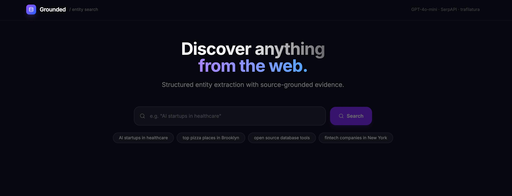
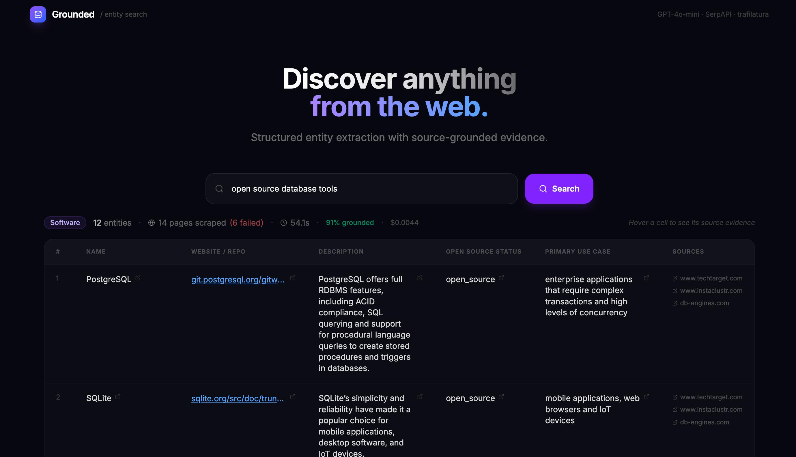

# Grounded — Agentic Entity Search

An agentic entity search engine that takes a natural language topic query and returns a structured, source-grounded table of discovered entities from the live web. The system combines query classification, multi-query web retrieval, parallel scraping, LLM-based extraction, evidence verification, deduplication, multi-signal ranking, and per-query observability.

**Live Demo:** [grounded-entity-search.vercel.app](https://grounded-entity-search.vercel.app)
**API:** [grounded-api-6lin.onrender.com](https://grounded-api-6lin.onrender.com)

> Note: The backend runs on Render's free tier and spins down after 15 minutes of inactivity. The first request after a period of inactivity may take ~50 seconds to respond while the server wakes up.

### Landing Page


### Search Results


**Example queries:**
- `"AI startups in healthcare"` → table of companies with name, website, description, category, location
- `"top pizza places in Brooklyn"` → table of restaurants with name, neighborhood, cuisine, notable feature
- `"open source database tools"` → table of software tools with name, repo, description, open source status
- `"venture capital firms in NYC"` → company table with dynamically chosen fields like focus_area, portfolio_size
- `"best sci-fi novels of 2024"` → generic entity table with author, genre, year

---

## Architecture Overview

```
User Query
    │
    ▼
QueryService          ── LLM classifies entity type + generates schema fields
    │
    ▼
SearchService         ── LLM generates 3 query variants → sequential SerpAPI calls → merge + dedup by URL
    │
    ▼
Snippet Pre-Ranker    ── Scores search results by query term overlap + entity-type keywords + snippet length
    │                    Reorders before scraping and caps the pool to the top 8 candidates
    ▼
ScrapeService         ── Parallel HTTP fetch (top-8 candidates only) + trafilatura text extraction (ThreadPoolExecutor)
    │                    Filters to pages relevant to entity type
    ▼
ExtractionService     ── Parallel GPT-4o-mini calls per page (dynamic schema + dynamic JSON shape)
    │                    Validates: name ≤5 words, ≥2 filled fields
    │                    Hallucination check: verifies evidence is verbatim substring of page text
    ▼
AggregationService    ── Deduplicates by normalised entity ID
    │                    Merges fields across sources (prefers longer evidence)
    │                    Scores on 8 signals: completeness, source count, query relevance,
    │                       official domain match, source authority, entity-type keywords,
    │                       evidence quality, source rank
    ▼
Ranked JSON response  ── Every field carries value + source_url + evidence snippet
    │
    ▼
MetricsStore          ── Records per-query: stage timings, token cost, hallucination rate, scrape failures
```

---

## Design Decisions

### LLM-based query classification with dynamic schema

The system uses GPT-4o-mini to classify each query into an entity type and generate relevant schema fields. A query like `"VC firms focused on climate"` returns `["name", "website", "focus_area", "portfolio_size", "location"]` rather than a fixed company template.

A keyword-matching fallback activates if the LLM call fails, ensuring the pipeline never breaks. The LLM output is validated and sanitised: field names are coerced to snake_case, `"name"` is always first, and the list is capped at 6 fields.

**Why not pure keywords?** Keyword lists fail on anything not explicitly enumerated — `"best pasta spots"`, `"seed-stage B2B tools"`, `"notable alumni"`. The LLM generalises to arbitrary phrasing.

### Multi-query retrieval

Rather than issuing a single search, the system uses GPT-4o-mini to generate 3 query variants (e.g. `"best tacos in LA"` → `"most popular taqueria Los Angeles"` + `"top-rated taco spots LA 2024"`). Results are merged and deduplicated by URL, and low-quality domains (Reddit, Quora, Pinterest) are deprioritised.

**Why?** A single query returns a biased sample of the web. Variants surface different curated lists and authoritative sources that a single phrasing misses.

**Why are the SerpAPI calls sequential, not parallel?** They used to fire all 3 variants concurrently via a `ThreadPoolExecutor`, which looks like the obvious win. In practice, this SerpAPI plan/key throttles concurrent requests hard — profiling showed one request finishing in 0.17s while its two concurrent siblings queued for 26s and 55s. Issued back-to-back instead, all 3 typically finish in under 2s combined. Concurrency isn't free when the bottleneck is server-side rate limiting rather than client-side wait time.

### Snippet-based pre-ranking before scraping

Before scraping, search results are re-scored using a lightweight signal combining: query term overlap in title + snippet, entity-type keyword presence, snippet length (longer = richer), and domain trust penalties. The top candidates are scraped first.

This runs in <1ms (no LLM), so it adds zero latency while ensuring the scraper invests its limited budget (3 documents) in the most promising pages.

### Grounded extraction — no hallucination by design

The extraction prompt enforces strict grounding rules:
- Only use text explicitly present in the document
- Every field requires both a `value` and an `evidence` snippet copied verbatim from the page
- The JSON response shape is generated dynamically from the actual schema fields, not hardcoded

After extraction, a **hallucination detector** verifies that each evidence string is a real substring of the scraped document text (case-insensitive, whitespace-normalised). Unverified evidence is flagged and the verification rate is reported in the response metadata.

### Entity validation

Two validation gates prevent garbage entities from propagating:
1. **Name length limit** — names longer than 5 words are rejected as taglines, not proper names. This specifically prevents sites like `topstartups.io` (which shows taglines more prominently than names) from producing `"AI automation platform for medical documents"` as an entity name.
2. **Minimum field completeness** — entities with fewer than 2 filled non-name fields are dropped.

### Deduplication with type-aware normalisation

Entity IDs are normalised slugs of the entity name. A regex strips trailing type-indicator words (`pizza`, `restaurant`, `pizzeria`, `cafe`, etc.) before comparison, so `"Chrissy's"` and `"Chrissy's Pizza"` correctly merge rather than creating duplicate rows.

When merging, fields from multiple sources are combined by preferring the cell with the longest evidence (a proxy for richer information). All source URLs are preserved on the merged entity.

### Multi-signal scoring

Entities are ranked by a composite score across 8 signals:

| Signal | Weight | Rationale |
|---|---|---|
| Filled non-name fields | 2.0× per field | Completeness |
| Unique supporting sources | 1.5× per source | Corroboration |
| Query term overlap | 2.0× per term | Relevance |
| Official domain match | +2.0 | Entity has own site |
| Source type (GitHub/Reddit) | ±variable | Authority |
| Entity-type keyword match | +0.75× per keyword | Type relevance |
| Evidence quality | up to +3.0 | Richness of evidence |
| Best source rank | max(0, 6−rank) | Search prominence |
| Single-source penalty | −1.0 | Low corroboration |

**Evidence quality** is a new signal that separates entities with long, specific evidence from those with short or missing evidence. It combines: average evidence length (capped at +2.0), evidence coverage across fields (+1.0), and a per-field penalty for evidence shorter than 15 characters (−0.3 each).

### Latency: 140s → 30–40s → 10–15s

Both scraping and LLM extraction run in `ThreadPoolExecutor` pools, which brought end-to-end latency from ~140s (original sequential implementation) down to ~30–40s. A second pass of profiling on the 30–40s version found the remaining time wasn't where it looked:

- **Query interpretation and search ran back-to-back** even though neither depends on the other's output. They now run concurrently, hiding one full LLM round-trip.
- **Every merged search result was scraped** (up to ~15 URLs after dedup across 3 query variants), even though only the top 3 relevant pages are ever used for extraction. Scraping is now capped to the top 8 candidates after snippet-reranking, with concurrency and per-request timeouts sized to match.
- **The 3 SerpAPI calls were parallelized**, which turned out to be actively counterproductive on this plan/key — see the concurrency note under Multi-query retrieval above.
- **Extraction latency was dominated by output length**, not input length: a single content-rich list page could generate 3,000–4,600 output tokens (~20–38s on its own) because the model would extract every entity it found. Extraction is now capped to the 6 most relevant entities per document with a `max_tokens` safety bound, since downstream deduplication across 3 documents already gives enough coverage without needing every entity from every page.

Net effect: typical end-to-end latency is now ~10–15s, with occasional spikes into the 20s when both a slow SerpAPI leg and a content-heavy page land in the same run.

### Monitoring and observability

Every pipeline run records:
- Per-stage wall-clock timings (search, scrape, extract, aggregate)
- Token counts (input + output) from OpenAI response headers
- Estimated cost in USD (GPT-4o-mini pricing: $0.15/1M input, $0.60/1M output)
- Scrape success/failure counts
- Evidence verification rate (grounding quality)
- Entity counts before and after deduplication

An in-memory ring buffer stores the last 200 query records. `GET /metrics` returns aggregate statistics including average latency, average cost per query, average hallucination rate, and scrape failure rate.

Structured logging uses Python's `logging` module with consistent format `%(asctime)s [%(levelname)s] %(name)s: %(message)s`, giving a per-stage trace of every pipeline run.

---

## Trade-offs & Known Limitations

| Limitation | Detail |
|---|---|
| Single-depth crawling | The system scrapes the pages returned by search but never follows links to entity homepages. Company `website` and `location` fields are often null because list articles don't embed direct URLs inline. A second-pass crawl (fetch entity's own site after finding its name) would fix this. |
| JavaScript rendering | Pages built with React/Next.js return near-empty HTML to `requests`. Affected pages silently produce `fetch_success=False`. A Playwright fallback for pages returning <300 chars of text would cover this. |
| LLM classification cost | Each query makes 2 LLM calls before any scraping (classification + query expansion). At GPT-4o-mini pricing this adds ~$0.001 per query; classification runs concurrently with search so it adds little to latency. |
| Multi-query SerpAPI cost | 3 SerpAPI searches per query instead of 1. At ~$0.001/search this triples the search cost to ~$0.003 per query. They run sequentially (not in parallel) to avoid per-key concurrency throttling — see Design Decisions. |
| Per-document entity cap | Extraction is capped at 6 entities per document to bound LLM output latency. A page listing more than 6 relevant entities will have the rest dropped from that document, though deduplication across 3 documents usually still surfaces most of them. |
| Schema variability | Dynamic schema means field names vary by query. The aggregation scoring handles any field names, but the frontend renders whatever columns come back. A query returning unusual field names will display correctly but may look sparse. |
| No persistent cache | Repeated identical queries re-run the full pipeline. An in-memory or Redis cache keyed by query string would make re-fetches instant and free. |
| Evidence verification is strict | Hallucination detection uses exact substring matching after whitespace normalisation. Some evidence that is paraphrased rather than copied verbatim (even if accurate) will be marked unverified. This is a conservative measure — false positives are preferable to false negatives for a grounding system. |
| Deduplication is name-based | Two entities with slightly different names (e.g. `"Viz.ai"` vs `"Viz AI"`) won't merge. Fuzzy matching (edit distance or embedding similarity) would improve recall at the cost of precision. |
| Metrics are prototype-scale | The 200-record in-memory ring buffer is observability for one instance during development, not production metrics infrastructure — it resets on every restart and isn't shared across workers if this were ever scaled beyond a single Render dyno. A real deployment would need persistent, aggregatable metrics (e.g. Prometheus/Grafana or a hosted APM). |
| Test coverage is unit-level only | See Testing below — the pure business logic (aggregation, extraction parsing, classification) has unit tests, but there's no integration/e2e coverage of the full pipeline and no CI running the suite automatically. |

---

## Setup

### Prerequisites
- Python 3.11+
- Node 18+
- SerpAPI key → [serpapi.com](https://serpapi.com)
- OpenAI API key → [platform.openai.com](https://platform.openai.com)

### Backend

```bash
cd grounded_entity_search
python -m venv venv
source venv/bin/activate        # Windows: venv\Scripts\activate
pip install -r requirements.txt
```

Create a `.env` file in the project root:

```env
OPENAI_API_KEY=sk-...
SEARCH_API_KEY=your_serpapi_key
```

Start the API server:

```bash
uvicorn app.main:app --reload
```

API runs at `http://localhost:8000`. Interactive docs at `http://localhost:8000/docs`.

### Frontend

```bash
cd frontend
npm install
npm run dev
```

Frontend runs at `http://localhost:5173`.

---

## Testing

```bash
source venv/bin/activate
pip install -r requirements.txt
pytest
```

55 unit tests cover the pure business logic that doesn't require network access: `aggregation_service` (dedup key normalisation, group merging, scoring signals like official-site detection and single-source penalty), `extraction_service` (JSON response parsing across raw/fenced/embedded shapes, field/evidence cleaning, hallucination verification, entity-ID slugification, meaningfulness gating), `query_service` (LLM-response validation and the keyword-fallback classifier), and `search_service` (SerpAPI result parsing). A `conftest.py` seeds dummy API keys so the suite never touches a real key or makes a network call.

**What isn't covered, honestly:** there are no integration or end-to-end tests — every pipeline run in this README's benchmarks was validated manually (start the server, `curl /discover`, read the structured logs). There's also no test for the orchestrator's concurrency behavior (the `ThreadPoolExecutor` usage in search/scrape/extract), no load or scale testing beyond single manual queries, and no CI configured to run the suite automatically on push. If asked what to add next: an integration test that mocks the OpenAI/SerpAPI clients and asserts on `DiscoveryOrchestrator.run()`'s output shape would be the highest-value addition, since it's the one thing today's unit tests can't catch — a regression in how the stages compose.

---

## API Reference

### Core endpoints

| Method | Path | Description |
|---|---|---|
| `GET` | `/health` | Health check |
| `GET` | `/metrics` | Aggregate pipeline metrics (latency, cost, hallucination rate) |
| `POST` | `/discover` | **Main endpoint** — full pipeline, returns ranked entity table |

### Debug endpoints

| Method | Path | Description |
|---|---|---|
| `POST` | `/debug/search` | Search only — returns raw SerpAPI results |
| `POST` | `/debug/scrape` | Search + scrape — returns extracted page text |
| `POST` | `/debug/extract` | Search + scrape + extract — returns entities before aggregation |
| `POST` | `/debug/discover` | Full pipeline with detailed timing breakdown |

### Request body (all POST endpoints)

```json
{ "query": "AI startups in healthcare" }
```

### Response — `/discover`

```json
{
  "query": "AI startups in healthcare",
  "entity_type": "company",
  "schema_fields": ["name", "website", "description", "category", "location"],
  "results": [
    {
      "entity_id": "hippocratic-ai",
      "entity_type": "company",
      "fields": {
        "name": {
          "value": "Hippocratic AI",
          "source_url": "https://hippocraticai.com/",
          "evidence": "Only Hippocratic AI Has Been Clinically Validated on Outputs"
        },
        "website": {
          "value": "https://hippocraticai.com/",
          "source_url": "https://hippocraticai.com/",
          "evidence": "Hippocratic AI | Safest Generative AI Healthcare Agent"
        },
        "description": { "value": "...", "source_url": "...", "evidence": "..." },
        "category": { "value": "Healthcare AI", "source_url": "...", "evidence": "..." },
        "location": { "value": null, "source_url": null, "evidence": null }
      },
      "supporting_sources": ["https://hippocraticai.com/"],
      "score": 22.4
    }
  ],
  "metadata": {
    "search_results_considered": 21,
    "pages_scraped": 7,
    "pages_failed": 1,
    "entities_extracted_before_dedup": 14,
    "entities_after_dedup": 11,
    "hallucination_rate": 0.03,
    "evidence_verified": 58,
    "evidence_total": 60,
    "estimated_cost_usd": 0.0029,
    "stage_timings": {
      "search": 1.29,
      "scrape": 1.05,
      "extract": 7.57,
      "aggregate": 0.00
    }
  },
  "execution_time_seconds": 9.91
}
```

### Response — `GET /metrics`

```json
{
  "total_queries": 12,
  "avg_latency_s": 14.8,
  "avg_entities_returned": 13.1,
  "avg_hallucination_rate": 0.031,
  "avg_scrape_failure_rate": 0.18,
  "total_estimated_cost_usd": 0.032,
  "avg_cost_per_query_usd": 0.0027,
  "avg_stage_timings": {
    "search": 3.1,
    "scrape": 1.1,
    "extract": 8.6,
    "aggregate": 0.01
  },
  "recent": [
    {
      "query": "top pizza places in Brooklyn",
      "entity_type": "restaurant",
      "entities": 18,
      "hallucination_rate": 0.14,
      "cost_usd": 0.0029,
      "time_s": 13.04
    }
  ]
}
```

---

## Project Structure

```
grounded_entity_search/
├── app/
│   ├── main.py                        # FastAPI app + CORS
│   ├── api/
│   │   └── routes.py                  # All HTTP endpoints
│   ├── core/
│   │   ├── config.py                  # Pydantic settings (.env)
│   │   └── logging.py                 # Structured logger factory
│   ├── models/
│   │   ├── entity_models.py           # SearchResult, ScrapedDocument, ExtractedEntity
│   │   ├── request_models.py          # DiscoverRequest
│   │   └── response_models.py         # DiscoverResponse, DiscoverMetadata
│   ├── prompts/
│   │   └── extraction_prompts.py      # Dynamic system + user prompt builders
│   └── services/
│       ├── query_service.py           # LLM query classification + keyword fallback
│       ├── search_service.py          # Multi-query SerpAPI + query expansion
│       ├── scrape_service.py          # Parallel scraping + trafilatura
│       ├── extraction_service.py      # GPT-4o-mini extraction + hallucination detection
│       ├── aggregation_service.py     # Dedup + merge + multi-signal scoring
│       ├── discovery_orchestrator.py  # Pipeline coordinator + snippet pre-ranker
│       └── metrics_store.py           # In-memory metrics ring buffer
├── frontend/
│   └── src/
│       └── components/layout/
│           └── PageLayout.jsx         # Full UI: search, table, evidence tooltips
├── tests/
│   ├── conftest.py                    # Seeds dummy API keys so tests need no real secrets
│   ├── test_aggregation_service.py    # Dedup, merging, multi-signal scoring
│   ├── test_extraction_service.py     # JSON parsing, field cleaning, hallucination checks
│   ├── test_query_service.py          # Classification validation + keyword fallback
│   └── test_search_service.py         # SerpAPI result parsing
├── requirements.txt
└── README.md
```
